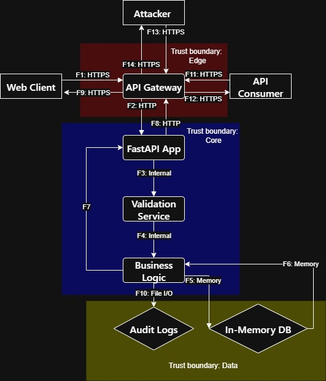

# DFD — Data Flow Diagram (Reading List API)

## Диаграмма потоков данных

## Описание архитектуры

### Компоненты системы:
- **Внешние сущности**: Web Client, API Consumer, Attacker
- **Процессы**: API Gateway, FastAPI Application, Validation Service, Business Logic
- **Хранилища**: In-Memory Database, Audit Logs
- **Границы доверия**: Edge, Core, Data

## Список потоков данных

| ID | Откуда → Куда | Канал/Протокол | Данные/PII | Комментарий |
|---|---|---|---|---|
| F1 | Web Client → API Gateway | HTTPS/JSON | Book CRUD requests | Пользовательские запросы |
| F2 | API Gateway → FastAPI App | HTTP/JSON | HTTP requests | Внутренняя маршрутизация |
| F3 | FastAPI App → Validation Service | Internal call | Raw book data | Валидация данных книги |
| F4 | Validation Service → Business Logic | Internal call | Validated book data | Проверенные данные |
| F5 | Business Logic → In-Memory DB | Memory access | Book operations | CRUD операции |
| F6 | In-Memory DB → Business Logic | Memory access | Book entities | Чтение книг |
| F7 | Business Logic → FastAPI App | Internal call | Response data | Данные для ответа |
| F8 | FastAPI App → API Gateway | HTTP/JSON | HTTP responses | Внутренние ответы |
| F9 | API Gateway → Web Client | HTTPS/JSON | API responses | Финальные ответы |
| F10 | Business Logic → Audit Logs | File I/O | Audit entries | Логирование операций |
| F11 | API Consumer → API Gateway | HTTPS/JSON | API requests | Внешние интеграции |
| F12 | API Gateway → API Consumer | HTTPS/JSON | API responses | Ответы интеграциям |
| F13 | Attacker → API Gateway | HTTPS/JSON | Malicious payloads | Потенциальные атаки |
| F14 | API Gateway → Attacker | HTTPS/JSON | Error responses | Защитные ответы |
